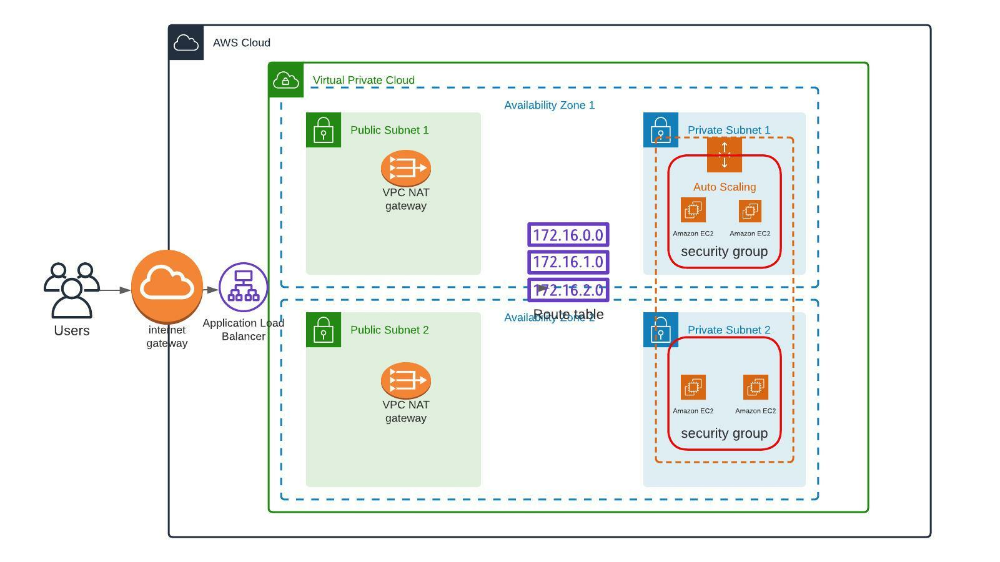

## Deploy a high-availability web app using terraform

This project proves my mastery of the following learning objectives:

- Diagram: creating cloud archicture diagram using lucid chart
- Script: Creating a matching terraform script for the diagram

### Built With

- [Lucid Chart](www.lucidchart.com/pages) - Intelligent diagramming application
- [Amazon AWS](https://aws.amazon.com/) - Cloud services
- [Terraform](https://terraform.io) - Infrastrcuture as code

### License

[License](LICENSE.md)
